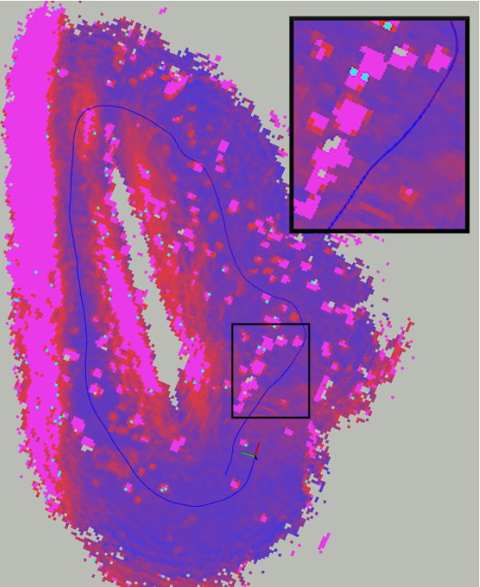

# Traversability Mapping

This ROS2 package produces traversability cost maps based on point cloud statistics and ground robot characteristics. It is built upon the library [Grid Map](https://github.com/ANYbotics/grid_map/tree/master) to allow proper visualization of the map.

<p align='center'>
    
</p>

## Dependencies

Here are the dependencies:
* [ROS2](https://docs.ros.org/en/jazzy/index.html) This package was tested on Galactic and Humble
* [Grid Map](https://github.com/ANYbotics/grid_map/tree/master) A C++ library to manage two-dimensional grid maps
* [Eigen](https://eigen.tuxfamily.org/dox/GettingStarted.html) a linear algebra library

## Instructions

Once these are all installed, use the following commands to build:

```
cd ~/your_ws/src
git clone https://github.com/ISAE-PNX/Traversability.git
cd ..
colcon build --symlink-install --packages-select traversability_gridmap
```
Then launch the program with:
```
ros2 launch traversability_gridmap traversability_launch.py
```
This package simply subscribes to point clouds to generate a traversability costmap. Edit the [launch file](launch/traversability_launch.py) to set the point cloud topic. If the point clouds are in an ego-centric frame, you may use the local mode by setting ``"global_mapping":False``. If the point clouds are in a global frame, don't hesitate to set ``"global_mapping":True`` to perform global traversability mapping. 